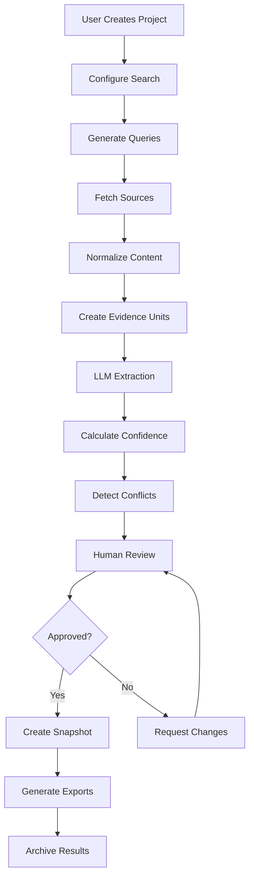

# Architecture Documentation

**Project:** Web Application Platform for Traceable, Evidence-Bound Persona Extraction  
**Version:** 1.0  
**Date:** 2025-09-15  
**Owner:** Engineering Team  

---

## Table of Contents

1. [System Overview](#system-overview)
2. [High-Level Architecture](#high-level-architecture)
3. [Data Architecture](#data-architecture)
4. [Service Architecture](#service-architecture)
5. [Frontend Architecture](#frontend-architecture)
6. [API Design](#api-design)
7. [Data Flow](#data-flow)
8. [Security Architecture](#security-architecture)
9. [Deployment Architecture](#deployment-architecture)
10. [Technology Stack](#technology-stack)
11. [Scalability Considerations](#scalability-considerations)
12. [Monitoring & Observability](#monitoring--observability)

---

## System Overview

The persona extraction platform is a **microservices-based web application** that extracts verifiable persona information from public web sources using LLMs, with complete traceability and evidence backing for every claim.

### Core Principles

- **Evidence-First**: Every claim must be backed by explicit evidence units
- **Traceability**: Complete audit trail from search to final persona
- **Reproducibility**: All inputs, parameters, and outputs are preserved
- **Human-in-the-Loop**: Critical review and approval workflow
- **Privacy-by-Design**: PDPA/GDPR compliance built-in

### System Boundaries

```
┌─────────────────────────────────────────────────────────────┐
│                 Persona Extraction Platform                 │
├─────────────────────────────────────────────────────────────┤
│  Frontend Web App │ Backend Services │ Database │ File Store │
└─────────────────────────────────────────────────────────────┘
         ↕                    ↕              ↕           ↕
┌─────────────────┐  ┌─────────────────┐  ┌────────┐  ┌────────┐
│   Web Browsers  │  │  External APIs  │  │ SQLite │  │ Local  │
│   (Users)       │  │ - Search APIs   │  │   DB   │  │ Files  │
│                 │  │ - LLM APIs      │  │        │  │        │
└─────────────────┘  └─────────────────┘  └────────┘  └────────┘
```

---

## High-Level Architecture

### Architectural Pattern: **Layered Architecture with Domain-Driven Design**

```
┌──────────────────────────────────────────────────────────────┐
│                    Presentation Layer                        │
│  ┌─────────────────┐  ┌─────────────────┐  ┌──────────────┐ │
│  │   Web Frontend  │  │   Admin Panel   │  │  API Docs    │ │
│  │   (React/Next)  │  │   (React/Next)  │  │  (Swagger)   │ │
│  └─────────────────┘  └─────────────────┘  └──────────────┘ │
└──────────────────────────────────────────────────────────────┘
                              ↕
┌──────────────────────────────────────────────────────────────┐
│                      API Gateway                             │
│  Authentication • Rate Limiting • Request/Response Logging   │
└──────────────────────────────────────────────────────────────┘
                              ↕
┌──────────────────────────────────────────────────────────────┐
│                    Application Layer                         │
│  ┌─────────────┐ ┌─────────────┐ ┌─────────────┐ ┌─────────┐ │
│  │   Search    │ │  Evidence   │ │  Persona    │ │ Export  │ │
│  │ Orchestrator│ │  Processor  │ │ Extractor   │ │ Service │ │
│  └─────────────┘ └─────────────┘ └─────────────┘ └─────────┘ │
└──────────────────────────────────────────────────────────────┘
                              ↕
┌──────────────────────────────────────────────────────────────┐
│                     Domain Layer                             │
│  ┌─────────────┐ ┌─────────────┐ ┌─────────────┐ ┌─────────┐ │
│  │   Project   │ │  Evidence   │ │   Persona   │ │  User   │ │
│  │   Domain    │ │   Domain    │ │   Domain    │ │ Domain  │ │
│  └─────────────┘ └─────────────┘ └─────────────┘ └─────────┘ │
└──────────────────────────────────────────────────────────────┘
                              ↕
┌──────────────────────────────────────────────────────────────┐
│                 Infrastructure Layer                         │
│  ┌─────────────┐ ┌─────────────┐ ┌─────────────┐ ┌─────────┐ │
│  │  Database   │ │  File Store │ │ External    │ │ Logging │ │
│  │  (Prisma)   │ │  (Local FS) │ │ APIs        │ │ Service │ │
│  └─────────────┘ └─────────────┘ └─────────────┘ └─────────┘ │
└──────────────────────────────────────────────────────────────┘
```

---

## Data Architecture

### Database Design (SQLite with Prisma)

```sql
-- Core Entities Relationship
Project (1) → (N) Run → (N) Source → (N) EvidenceUnit
Project (1) → (N) ClaimField → (N) Citation → (N) EvidenceUnit
ClaimField (1) → (1) Confidence
ClaimField (1) → (N) ConflictNote
Project (1) → (N) Export
```

### Data Storage Strategy

```
┌─────────────────────────────────────────────────────────────┐
│                     Data Storage Layers                     │
├─────────────────────────────────────────────────────────────┤
│  Application Data    │ SQLite Database (via Prisma ORM)    │
│  - Projects          │ - ACID compliance                   │
│  - Runs              │ - Referential integrity            │
│  - Evidence          │ - Full-text search capability      │
│  - Claims            │ - Backup & restoration             │
│  - Citations         │                                     │
├─────────────────────────────────────────────────────────────┤
│  File Storage        │ Local File System                  │
│  - Raw HTML/Text     │ - Organized by project/run         │
│  - Exports (PDF/CSV) │ - Checksum validation              │
│  - Audit Logs        │ - Retention policies               │
│  - Cached Results    │                                     │
├─────────────────────────────────────────────────────────────┤
│  Search Index        │ SQLite FTS5 (Future: Vector DB)    │
│  - Evidence Units    │ - Full-text search                 │
│  - Topic Candidates  │ - Semantic similarity (future)     │
│  - Source Content    │ - Faceted search                   │
└─────────────────────────────────────────────────────────────┘
```

### Data Flow Architecture

```
┌─────────┐    ┌─────────┐    ┌─────────┐    ┌─────────┐
│ Search  │───▶│ Fetch & │───▶│Evidence │───▶│ LLM     │
│ Queries │    │ Store   │    │ Units   │    │Extract  │
└─────────┘    └─────────┘    └─────────┘    └─────────┘
                                                   │
┌─────────┐    ┌─────────┐    ┌─────────┐    ┌─────▼───┐
│ Export  │◀───│ Human   │◀───│Conflict │◀───│ Draft   │
│ System  │    │ Review  │    │ Resolve │    │ Persona │
└─────────┘    └─────────┘    └─────────┘    └─────────┘
```

---

## Service Architecture

### Microservices Breakdown

#### 1. **API Gateway Service**
```typescript
// Responsibilities:
- Authentication & Authorization (JWT/OIDC)
- Rate limiting and throttling
- Request/response logging
- API versioning
- CORS handling

// Technology: Express.js with middleware
```

#### 2. **Search Orchestrator Service**
```typescript
// Responsibilities:
- Query generation and diversification
- Search provider abstraction
- Result aggregation and deduplication
- Rate limit management for external APIs

// Key Components:
- QueryGenerator: Creates search variations
- SearchProvider: Pluggable search interfaces
- ResultAggregator: Merges and deduplicates results
```

#### 3. **Content Fetcher & Normalizer Service**
```typescript
// Responsibilities:
- Web page fetching with retries
- Content extraction (HTML → text)
- Text normalization and cleaning
- Content hashing and deduplication
- Robots.txt compliance

// Key Components:
- Fetcher: HTTP client with retry logic
- Parser: HTML/PDF content extraction
- Normalizer: Text cleaning and standardization
- HashCalculator: Content fingerprinting
```

#### 4. **Evidence Processing Service**
```typescript
// Responsibilities:
- Text segmentation (200-400 char units)
- Topic candidate identification
- Quality scoring
- Semantic deduplication
- Evidence unit indexing

// Key Components:
- Segmenter: Intelligent text chunking
- TopicExtractor: Keyword/phrase extraction
- QualityScorer: Relevance and quality assessment
- Deduplicator: Near-duplicate detection
```

#### 5. **LLM Orchestrator Service**
```typescript
// Responsibilities:
- Prompt engineering and validation
- Evidence-only constraint enforcement
- Citation requirement enforcement
- Multi-model support and fallbacks
- Response validation

// Key Components:
- PromptBuilder: Context-aware prompt generation
- CitationValidator: Ensures proper evidence citation
- ResponseParser: Structured output extraction
- ModelManager: Multi-LLM support
```

#### 6. **Scoring & Conflict Engine**
```typescript
// Responsibilities:
- Confidence score calculation
- Source agreement analysis
- Conflict detection algorithms
- Resolution recommendation
- Score component tracking

// Key Components:
- ConfidenceCalculator: Multi-factor scoring
- ConflictDetector: Contradiction identification
- SourceAnalyzer: Quality and agreement assessment
```

#### 7. **Review & Workflow Service**
```typescript
// Responsibilities:
- Review assignment and routing
- Approval workflow management
- Version control and history
- Decision logging
- Notification system

// Key Components:
- WorkflowEngine: State machine for reviews
- VersionManager: Immutable change tracking
- NotificationService: Email/webhook alerts
```

#### 8. **Export Service**
```typescript
// Responsibilities:
- Multi-format export generation
- Checksum calculation
- Template rendering
- Batch export processing
- File archival and cleanup

// Key Components:
- TemplateEngine: PDF/Markdown generation
- ChecksumCalculator: File integrity verification
- ArchiveManager: Export lifecycle management
```

#### 9. **Audit & Telemetry Service**
```typescript
// Responsibilities:
- Comprehensive audit logging
- Performance metrics collection
- Error tracking and alerting
- Usage analytics
- Compliance reporting

// Key Components:
- AuditLogger: Tamper-evident logging
- MetricsCollector: Performance monitoring
- AlertManager: Real-time notifications
```

---

## Frontend Architecture

### Component Architecture (React/Next.js)

```
src/
├── components/
│   ├── ui/                 # Reusable UI components
│   ├── forms/             # Form components with validation
│   ├── tables/            # Data display components
│   └── charts/            # Visualization components
├── features/
│   ├── projects/          # Project management
│   ├── search/            # Search configuration
│   ├── evidence/          # Evidence review
│   ├── personas/          # Persona editing
│   ├── review/            # Human review workflow
│   └── exports/           # Export management
├── hooks/                 # Custom React hooks
├── utils/                 # Utility functions
├── types/                 # TypeScript definitions
└── constants/             # Application constants
```

### State Management Strategy

```typescript
// Global State: Zustand for simple global state
interface AppState {
  user: User | null;
  currentProject: Project | null;
  notifications: Notification[];
}

// Local State: React Query for server state
- Projects list
- Evidence units
- Review queue
- Export status

// Form State: React Hook Form
- Search configuration
- Persona editing
- Review decisions
```

### Key Frontend Features

#### 1. **Evidence Review Interface**
```typescript
// Split-pane layout showing:
- Left: Evidence units with highlighting
- Right: Persona claims with citations
- Bottom: Conflict resolution panel
```

#### 2. **Confidence Visualization**
```typescript
// Interactive confidence dashboard:
- Field-level confidence meters
- Source agreement indicators
- Evidence density heatmaps
- Conflict indicators
```

#### 3. **Real-time Updates**
```typescript
// WebSocket connections for:
- Processing status updates
- Review notifications
- Collaborative editing (future)
```

---

## API Design

### RESTful API Structure

```
/api/v1/
├── /auth
│   ├── POST /login
│   ├── POST /logout
│   └── GET /profile
├── /projects
│   ├── GET /projects
│   ├── POST /projects
│   ├── GET /projects/:id
│   ├── PUT /projects/:id
│   └── DELETE /projects/:id
├── /runs
│   ├── POST /projects/:id/runs
│   ├── GET /runs/:id
│   └── GET /runs/:id/status
├── /evidence
│   ├── GET /runs/:id/evidence
│   ├── GET /evidence/:id
│   └── PUT /evidence/:id/quality
├── /personas
│   ├── GET /projects/:id/personas
│   ├── PUT /personas/:id
│   └── POST /personas/:id/review
├── /exports
│   ├── POST /projects/:id/exports
│   ├── GET /exports/:id
│   └── GET /exports/:id/download
└── /admin
    ├── GET /users
    ├── GET /metrics
    └── GET /audit-logs
```

### API Response Format

```typescript
// Standard response wrapper
interface ApiResponse<T> {
  success: boolean;
  data?: T;
  error?: {
    code: string;
    message: string;
    details?: unknown;
  };
  meta?: {
    pagination?: PaginationMeta;
    timing?: number;
    version?: string;
  };
}

// Error handling
interface ApiError {
  code: 'VALIDATION_ERROR' | 'NOT_FOUND' | 'UNAUTHORIZED' | 'RATE_LIMITED';
  message: string;
  field?: string; // For validation errors
  retryAfter?: number; // For rate limiting
}
```

---

## Data Flow

### Complete Pipeline Data Flow



### Evidence Processing Pipeline

```typescript
// 1. Source Processing
Source → ContentNormalizer → TextSegmentation → EvidenceUnits

// 2. Evidence Enhancement
EvidenceUnits → TopicExtraction → QualityScoring → Deduplication

// 3. Persona Extraction
EvidenceUnits + Prompts → LLM → DraftPersona + Citations

// 4. Validation & Scoring
DraftPersona → ConfidenceCalculation → ConflictDetection → Review
```

---

## Security Architecture

### Authentication & Authorization

```typescript
// Authentication Flow
Browser → API Gateway → Auth Service → JWT Token
         ↓
    Protected Routes ← Middleware Validation ← Token Verification

// Authorization Matrix
interface Permissions {
  'project:create': ['researcher', 'admin'];
  'project:read': ['researcher', 'reviewer', 'admin'];
  'persona:edit': ['researcher', 'admin'];
  'persona:approve': ['reviewer', 'admin'];
  'admin:users': ['admin'];
}
```

### Data Security

```typescript
// Encryption at Rest
- Database: SQLite encryption (optional)
- Files: AES-256 encryption for sensitive exports
- Logs: PII scrubbing and encryption

// Encryption in Transit
- HTTPS/TLS 1.3 for all communications
- WebSocket Secure (WSS) for real-time updates
- API key encryption for external services

// PII Protection
- Automatic PII detection and masking
- Audit trail for all personal data access
- Data retention and deletion policies
```

### Security Controls

```typescript
// Input Validation
- Schema validation on all API endpoints
- SQL injection prevention (Prisma ORM)
- XSS protection (Content Security Policy)
- CSRF protection

// Rate Limiting
- Per-user API rate limits
- Search provider quota management
- LLM API usage controls
- Export generation throttling

// Audit & Compliance
- Immutable audit logs
- GDPR data subject rights implementation
- Regular security assessments
- Dependency vulnerability scanning
```

---

## Deployment Architecture

### Local Development Setup

```yaml
# docker-compose.yml for development
services:
  app:
    build: .
    ports: ["3000:3000"]
    volumes: ["./:/app"]
    environment:
      - DATABASE_URL=file:./dev.db
      - NODE_ENV=development
  
  # Optional: Redis for caching (future)
  # Optional: Vector database (future)
```

### Production Deployment Options

#### Option 1: Single Server Deployment
```
┌─────────────────────────────────────┐
│           Production Server          │
├─────────────────────────────────────┤
│  Frontend (Static) + Backend (Node) │
│  SQLite Database + File Storage     │
│  Reverse Proxy (Nginx)              │
│  Process Manager (PM2)              │
│  SSL/TLS Termination                │
└─────────────────────────────────────┘
```

#### Option 2: Container Deployment
```yaml
# docker-compose.prod.yml
services:
  frontend:
    image: persona-frontend:latest
    restart: always
  
  backend:
    image: persona-backend:latest
    restart: always
    volumes:
      - ./data:/app/data
      - ./uploads:/app/uploads
  
  nginx:
    image: nginx:alpine
    ports: ["80:80", "443:443"]
    volumes:
      - ./nginx.conf:/etc/nginx/nginx.conf
      - ./ssl:/etc/ssl
```

---

## Technology Stack

### Backend Stack

```typescript
// Core Framework
- Node.js 20+ (LTS)
- TypeScript 5+
- Express.js (API server)

// Database & ORM
- SQLite 3.42+ (embedded database)
- Prisma 5+ (ORM and migrations)

// External Integrations
- OpenAI API (LLM)
- Google Search API (web search)
- Anthropic Claude API (backup LLM)

// Utilities
- Zod (schema validation)
- Winston (logging)
- Jest (testing)
- Supertest (API testing)
```

### Frontend Stack

```typescript
// Core Framework
- React 18+
- Next.js 14+ (full-stack framework)
- TypeScript 5+

// UI & Styling
- Tailwind CSS (utility-first CSS)
- Headless UI (accessible components)
- React Hook Form (form handling)
- Recharts (data visualization)

// State Management
- React Query/TanStack Query (server state)
- Zustand (client state)

// Development Tools
- ESLint + Prettier (code quality)
- Storybook (component development)
- Jest + Testing Library (testing)
```

### DevOps & Infrastructure

```yaml
# Development
- Git (version control)
- GitHub Actions (CI/CD)
- Docker (containerization)
- Prettier + ESLint (code formatting)

# Security
- CodeQL (static analysis)
- Dependabot (dependency updates)
- npm audit (vulnerability scanning)
- HTTPS/TLS encryption

# Monitoring (Future)
- Application performance monitoring
- Error tracking
- Usage analytics
- Uptime monitoring
```

---

## Scalability Considerations

### Performance Optimization

```typescript
// Database Optimization
- Prisma query optimization
- Database indexing strategy
- Connection pooling
- Query result caching

// API Performance
- Response compression (gzip)
- API response caching
- Rate limiting and throttling
- Async processing for long operations

// Frontend Optimization
- Code splitting and lazy loading
- Image optimization
- Bundle size optimization
- Service worker caching
```

### Horizontal Scaling Strategy

```typescript
// Phase 1: Single Server (Current)
- SQLite database
- Local file storage
- In-memory caching

// Phase 2: Database Scaling
- PostgreSQL cluster
- Read replicas
- Connection pooling

// Phase 3: Service Scaling
- Microservices deployment
- Load balancers
- Redis caching
- CDN for static assets

// Phase 4: Advanced Scaling
- Kubernetes orchestration
- Message queues (RabbitMQ/Redis)
- Vector database for semantic search
- Multi-region deployment
```

---

## Monitoring & Observability

### Logging Strategy

```typescript
// Log Levels and Categories
interface LogEntry {
  level: 'error' | 'warn' | 'info' | 'debug';
  category: 'api' | 'database' | 'external' | 'security' | 'audit';
  message: string;
  metadata?: {
    userId?: string;
    projectId?: string;
    requestId?: string;
    duration?: number;
  };
  timestamp: string;
}

// Audit Trail
- All user actions
- Data modifications
- Search queries and results
- LLM interactions
- Export generations
```

### Metrics Collection

```typescript
// Application Metrics
- Request latency (p50, p95, p99)
- Error rates by endpoint
- Database query performance
- External API response times
- Evidence processing throughput

// Business Metrics
- Projects created per day
- Personas extracted per day
- Review completion times
- Export generation frequency
- User engagement metrics

// System Metrics
- Memory usage
- CPU utilization
- Disk space
- Network I/O
- Database size growth
```

### Health Checks

```typescript
// Endpoint: GET /health
interface HealthCheck {
  status: 'healthy' | 'degraded' | 'unhealthy';
  services: {
    database: 'up' | 'down';
    fileSystem: 'up' | 'down';
    externalAPIs: {
      searchProvider: 'up' | 'down' | 'limited';
      llmProvider: 'up' | 'down' | 'limited';
    };
  };
  version: string;
  uptime: number;
}
```

---

## Future Architecture Considerations

### Planned Enhancements

```typescript
// Vector Search Integration
- Semantic similarity search
- Evidence clustering
- Improved deduplication

// Real-time Collaboration
- WebSocket-based editing
- Operational transforms
- Conflict resolution

// Advanced Analytics
- Persona quality scoring
- Source reliability tracking
- Bias detection algorithms

// Multi-tenant Support
- Organization-level isolation
- Resource quotas
- Custom branding

// API Ecosystem
- Webhook notifications
- Third-party integrations
- Plugin architecture
```

### Migration Strategies

```typescript
// Database Migration Path
SQLite → PostgreSQL
- Data export/import scripts
- Schema compatibility layer
- Zero-downtime migration

// Microservices Migration
Monolith → Service-oriented
- Strangler fig pattern
- Feature toggles
- Gradual extraction

// Cloud Migration
Self-hosted → Cloud-native
- Containerization
- Infrastructure as code
- Automated deployments
```

---

This architecture document provides a comprehensive blueprint for building and scaling the persona extraction platform while maintaining the core principles of evidence traceability, security, and user experience.
